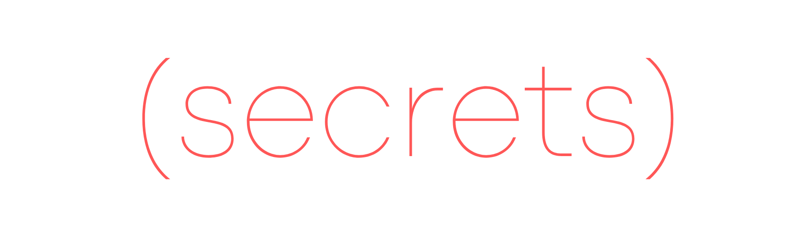

[](https://github.com/lk-geimfari/secrets.clj)

[](https://travis-ci.org/lk-geimfari/secrets.clj)
[](https://codecov.io/gh/lk-geimfari/secrets.clj)
[](https://clojars.org/likid_geimfari/secrets)
[](https://cljdoc.org/d/likid_geimfari/secrets/CURRENT)

The [`secrets`](https://github.com/lk-geimfari/secrets.clj) is a library designed to generate cryptographically strong random numbers suitable for managing data such as passwords, account authentication, security tokens, and related secrets.

The [`secrets`](https://github.com/lk-geimfari/secrets.clj) is an implementation of the [`secrets`](https://docs.python.org/3/library/secrets.html) 
module from Python's standard library for Clojure.

See [«Recipes and best practices»](#recipes-and-best-practices) for usage examples.

## Installation

**Leiningen/Boot**:

Add the following dependency to your `project.clj` file:

```clojure
[likid_geimfari/secrets "0.2.0"]
```

**Clojure CLI/deps.edn**:

```
likid_geimfari/secrets {:mvn/version "0.2.0"}
```

## Documentation

You can find the complete documentation on the [cljdoc](https://cljdoc.org/d/likid_geimfari/secrets/CURRENT).

## API
 
```clojure
user=> (secrets.core/token-hex 32)
"2aa5430064918acf140bb423678cef7353f7055597bc61305414c5371106ebef"

user=> (secrets.core/token-urlsafe 32)
"kfbGVrB6jz6hyOl_2rX9UIHgiop2-rM_jo2XEK7oTj0"

user=> (secrets.core/token-bytes 16)
#object["[B" 0x3b2454e9 "[B@3b2454e9"]

user=> (secrets.core/randbelow 100)
71

user=> (secrets.core/choice [8 16 32 64 128])
8

user=> (secrets.core/uuid4)
"84e9c5c0-ceb4-4aab-9a58-668f59b9a9e5"

user=> (secrets.core/unix-timestamp)
1601927558
```

There is a namespace `secrets.strings` with useful constants:

```clojure
user=> secrets.strings/ascii-lowercase
"abcdefghijklmnopqrstuvwxyz"
user=> secrets.strings/ascii-uppercase
"ABCDEFGHIJKLMNOPQRSTUVWXYZ"
user=> secrets.strings/ascii-letters
"abcdefghijklmnopqrstuvwxyzABCDEFGHIJKLMNOPQRSTUVWXYZ"
user=> secrets.strings/digits
"0123456789"
user=> secrets.strings/hexdigits
"0123456789abcdefABCDEF"
user=> secrets.strings/octdigits
"01234567"
user=> secrets.strings/punctuation
"!\"#$%&'()*+,-./:;<=>?@[\\]^_`{|}~"
```

## Recipes and best practices
This section shows recipes and best practices for using secrets to manage a basic level of security.

Generate an eight-character alphanumeric password:

```clojure
(ns example.security
  (:use [clojure.string :only [join]]
        [secrets.core]
        [secrets.strings :only [ascii-letters digits]]))

(defn generate-password [n]
  (join "" (secrets.core/choices (str ascii-letters digits)) n))

```

```clojure
example.security=> (generate-password 8)
"7gHY2N4s"
```

**Note**: Applications should not [store passwords in a recoverable format](http://cwe.mitre.org/data/definitions/257.html), 
whether plain text or encrypted. They should be salted and hashed using a cryptographically-strong one-way (irreversible) hash function.


Generate an [XKCD-style passphrase](https://xkcd.com/936/):

```clojure
(ns example.security
  (:use [secrets.core]
        [clojure.string :only [join lower-case split-lines]))

(def words
  (-> (slurp "/usr/share/dict/words")
      (split-lines)))

(defn generate-passphrase [n]
  (-> (join " " (secrets.core/choices words n))
      (lower-case)))
```

```clojure
example.security=> (generate-passphrase 5)
"uniaxally intercarrier straddleback basihyoid unhusk"
```

Generate a hard-to-guess temporary URL containing a security token suitable for password recovery applications:

```clojure
(ns example.security
  (:use [secrets.core :only [token-urlsafe]]))

(defn generate-password-recovery-url [n]
  (str "https://mydomain.com/reset=" (token-urlsafe n)))
```

```clojure
example.security=> (generate-password-recovery-url 32)
"https://mydomain.com/reset=3kOJuScK1mHyxXWnuMBAUQaIEdsBUluQBR-3Zlvv8XQ"
```

## License
MIT License. See [LICENSE](LICENSE) for more information.
